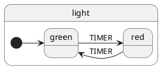
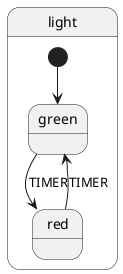

# xstate-plantuml

Visualize a [xstate](https://github.com/davidkpiano/xstate) or [react-automata](https://github.com/MicheleBertoli/react-automata) statechart as a [plantuml](https://github.com/plantuml/plantuml) state diagram.

This fork was created to add improved support for xstate@v4 and is currently installable by adding the following to package.json:
```json
  "@karfau/xstate-plantuml": "github:karfau/xstate-plantuml#{TAG OR HASH}"
```

## Installation

```json
  "@karfau/xstate-plantuml": "github:karfau/xstate-plantuml#{TAG OR HASH}"
```

<!--
```
npm install @karfau/xstate-plantuml
```
-->

### peerDependencies

Peer dependencies are optional: the methods that need them have an optional argument to pass alternatives that provide the same API.

- [`xstate`](https://github.com/davidkpiano/xstate)  
  used by `visualize`(see [Options](#visualize-options))  
  to install, run `npm install xstate`
- [`execa`](https://github.com/sindresorhus/execa) 
  used by `src/transfer:transfer.plantuml`  
  to install, run `npm install execa`

## Usage

### visualize
import `@karfau/xstate-plantuml` and call it's default export using a xstate config or machine

```js
import visualize from '@karfau/xstate-plantuml';

const config = {
  key: 'light',
  initial: 'green',
  states: {
    green: {
      on: {
        TIMER: 'red'
      }
    },
    red: {
      on: {
        TIMER: 'green'
      }
    }
  }
};

visualize(config);
```

Which returns a string, containing the following plantuml source



Which you can render to the following image


#### Options

In addition to a state machine, `visualize` accepts an options map

| option      | default | description                                                       |
| ----------- | ------- | ----------------------------------------------------------------- |
| leftToRight | true    | whether to render left to right or top to bottom                  |
| skinParams  | []      | Additional [skinparams](http://plantuml.com/skinparam) to include |
| xstate      | xstate (resolved module with that name) | to pass alternative implementaitons ([e.g. for testing](https://github.com/karfau/xstate-plantuml/blob/develop/src/__tests__/core.js)) |

Our previous example with different options

```js
visualize(config, {
  leftToRight: false,
  skinParams: ['monochrome true']
});
```



compiles to


### transfer

To directly use plantuml to transform a puml file to an image (or anything else) and only do that after updating the puml file.

There are some extra dependencies required for that:
- `execa` (see [peerDependencies](#peerdependencies))
- depending on the command used to execute `plantuml`:
  - `docker`
  - `java` and a local copy of `plantuml.jar` 

[`test-transfer.sh`](https://github.com/karfau/xstate-plantuml/blob/master/test-transfer.js) shows how it can be used. 

To import the transfer module in your project: 

```js
import transfer from '@karfau/xstate-plantuml/src/transfer';

transfer({...});
```

## Examples

Not all examples are listed here, please check [examples](https://github.com/karfau/xstate-plantuml/tree/develop/examples) for more

### Hierarchical state

- [json](./examples/alarm.json)
- [puml](./examples/alarm.puml)


### Parallel state

- [json](./examples/text-editor.json)
- [puml](./examples/text-editor.puml)


### History state

- [json](./examples/payment.json)
- [puml](./examples/payment.puml)


### Internal transitions

- [json](./examples/word.json)
- [puml](./examples/word.puml)


### Guards, actions and activities

#### xstate@v3:
- [json](./examples/download.json)
- [puml](./examples/download.puml)


#### xstate@v4:
- [json](./examples/invoke.json)
- [puml](./examples/invoke.puml)


